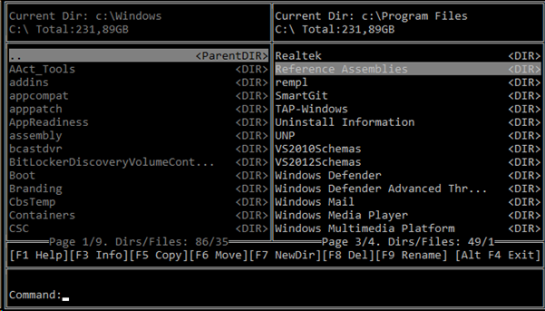
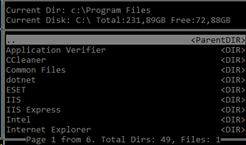
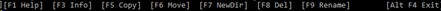

<h1>ConsoleFileManager</h1>

Release candidate, March 22, 2021.

C#, Console Application, .Net Core 3.1, Any CPU

Developer: Fakhrudinov Alexander, asbuka@gmail.com 

<h2>Description</h2>

An entry-level console file manager with two panels and a command line in the Windows environment.
 

Supported copying, deleting, moving through the directory structure, renaming, running files, creating new directories.

The work with the resizing of the console by the user has been implemented - to change it, you just need to stretch the window to the desired size.

Changes to the dimensions opened in the directory panels are saved and will be applied the next time the program is started.

The history of the commands entered by the user is saved, including the commands made in the file manager from the "F" buttons, such as F5, F6, etc. 

<h2>Main areas of the program </h2>

 Panel

 F buttons information

 Command

<h2>User manual</h2>

