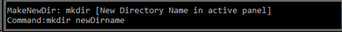

<h1>ConsoleFileManager</h1>

Release candidate, March 22, 2021.

C#, Console Application, .Net Core 3.1, Any CPU

Developer: Fakhrudinov Alexander, asbuka@gmail.com 

<h2>Description</h2>

An entry-level console file manager with two panels and a command line in the Windows environment.
 

Supported copying, deleting, moving through the directory structure, renaming, running files, creating new directories.

The work with the resizing of the console by the user has been implemented - to change it, you just need to stretch the window to the desired size.

Changes to the dimensions opened in the directory panels are saved and will be applied the next time the program is started.

The history of the commands entered by the user is saved, including the commands made in the file manager from the "F" buttons, such as F5, F6, etc. 

<h2>Main areas of the program </h2>

 Panel.

Above - an information panel about the current directory and disk. 
Below is the line with directories and files in the current directory.
The highlighted line shows the currently selected object. 
Bottom line - information about pagination on the panel and the total number of directories and files. 

 F buttons information

The available 'F' keys are shown here with a brief description of the action to be performed. 

 Command panel

On the command panel there are 2 lines - at the bottom, the user enters the command and its arguments. The top line shows a hint for the entered command and an estimate of the entered path.

<h2>User manual</h2>
<h3>Panel operations</h3>

<strong>Basic navigation.</strong> To navigate within the panel, use the up and down arrows, pgUp, pgDown, Home, End buttons. 
Press Enter to start and open the file, as well as to enter the directory and move to the parent directory "..". 
Tab to change the active panel. 
To change the disk, press enter on ".." while in the root directory of the disk.

<strong>F1 Help</strong> Will show a panel with a list of available commands. Press Enter to close the information window.

<strong>F3 Info</strong> Shows information about the selected object. Press Enter to close the information window.

<strong>F5 Copy</strong> Copies selected object to an inactive panel. A confirmation dialog will be shown, where 'Y' or 'y' is confirmation, any other input will cancel the action.

<strong>F6 Move</strong> Moves selected object to an inactive panel.  A confirmation dialog will be shown, where 'Y' or 'y' is confirmation, any other input will cancel the action.

<strong>F7 NewDir</strong> Create a new directory in the current directory. New name request will be displayed. Enter a name to create or leave blank to cancel the action.

<strong>F8 Del</strong> Delete selected object in active panel. A confirmation dialog will be shown, where 'Y' or 'y' is confirmation, any other input will cancel the action.

<strong>F9 Rename</strong> Rename selected object in active panel. New name request will be displayed. Enter a name to create or leave blank to cancel the action.

<strong>Alt + F4 Exit.</strong> Close this program.

<h3>Command line operations</h3>

<strong>Ctrl + Enter</strong>

<strong>Ctrl + E</strong>

<strong>equal</strong> 

<strong>cd argument</strong> 

<strong>cp argument</strong> 

<strong>cp argument1, argument2</strong> 

<strong>mv argument</strong> 

<strong>mv argument1, argument2</strong> 

<strong>rm argument</strong> 

<strong>mkdir argument</strong> 

<strong>run argument</strong> 

<strong>name argument, argument2</strong> ???

<strong></strong> 

